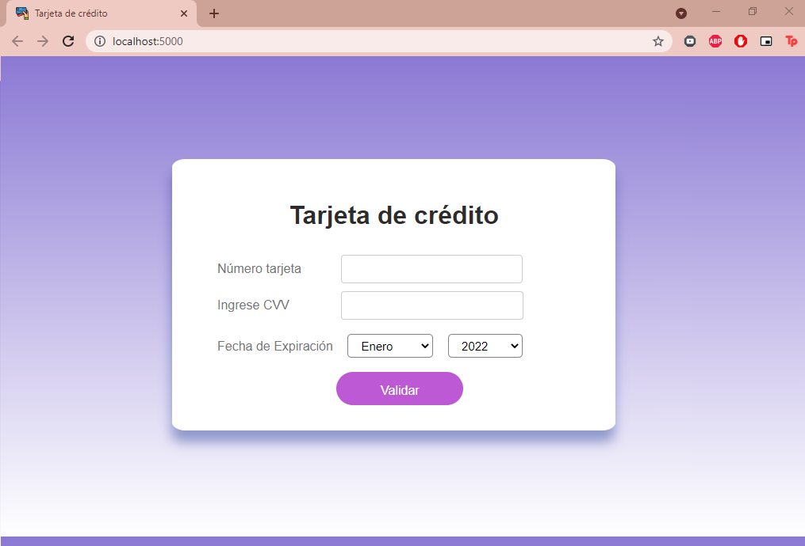

# Smart Card

#### Smart Card es una página web que sirve para validar la tarjeta de crédito de un usuario. Esta validación se realiza mediante el algoritmo de Luhn.

#### Cuando el usuario realice una compra, debe rellenar el formulario para realizar el pago correspondiente, por ende debe como principal paso se debe validar su número de tarjeta, el cvv y la fecha de expiración, con la finalidad que la compra se efectúe.

***

 
***

### Investigación UX:

#### Los usuarios de este proyecto son los clientes potenciales de cualquier producto o servicio en el e-commerce, que durante esta pandemia ha aumentado su porcentaje en un 50% en el año 2020 a diferencia del 2019, impulsado por el crecimiento del e-commerce retail (250%); Asimismo el objetivo es que se realice la transaccion que realizan nuestros usuarios priorizando que su número de tarjeta sea válida aplicando el algoritmo de Luhn.

Fuente: ecommercenews.pe

#### El formulario presentado evita que exista iregularidades y/o estafas a la empresa con quiénes trabajamos y su practicidad  brinda facilidades para los clientes en el llenado de solo datos imprescidibles, siendo que el proceso sea ágil para el usuario.

***

### HTML y CSS

* [ ] [Uso de HTML semántico.](https://developer.mozilla.org/en-US/docs/Glossary/Semantics#Semantics_in_HTML)
* [ ] Uso de selectores de CSS.
* [ ] Construir tu aplicación respetando el diseño realizado (maquetación).

### DOM

* [ ] Uso de selectores del DOM.
* [ ] Manejo de eventos del DOM.
* [ ] [Manipulación dinámica del DOM.](https://developer.mozilla.org/es/docs/Referencia_DOM_de_Gecko/Introducci%C3%B3n)
(appendChild |createElement | createTextNode| innerHTML | textContent | etc.)

### JavaScript

* [ ] Manipulación de strings.
* [ ] Uso de condicionales (if-else | switch | operador ternario)
* [ ] Uso de bucles (for | for..in | for..of | while)
* [ ] Uso de funciones (parámetros | argumentos | valor de retorno)
* [ ] Declaración correcta de variables (const & let)

### Testing

* [ ] [Testeo unitario.](https://jestjs.io/docs/es-ES/getting-started)

### Estructura del código y guía de estilo

* [ ] Organizar y dividir el código en módulos (Modularización)
* [ ] Uso de identificadores descriptivos (Nomenclatura | Semántica)
* [ ] Uso de linter (ESLINT)

### Git y GitHub

* [ ] Uso de comandos de git (add | commit | pull | status | push)
* [ ] Manejo de repositorios de GitHub (clone | fork | gh-pages)

### UX

* [ ] Diseñar la aplicación pensando y entendiendo al usuario.
* [ ] Crear prototipos para obtener feedback e iterar.
* [ ] Aplicar los principios de diseño visual (contraste, alineación, jerarquía)

## 4. Consideraciones generales

* El proyecto es individual. Recuerda que cada una aprende a diferente ritmo.
* El proyecto será entregado subiendo tu código a GitHub (commit/push) y la
  interfaz será desplegada usando GitHub pages. Si no sabes lo que es GitHub, no
  te preocupes, lo aprenderás durante este proyecto.

Organización del Trabajo:

* [Metodologías Ágiles](https://www.youtube.com/watch?v=v3fLx7VHxGM)
* [Scrum en menos de 2 minutos](https://www.youtube.com/watch?v=TRcReyRYIMg)
* [Scrum en Detalle](https://www.youtube.com/watch?v=nOlwF3HRrAY&t=297s). No
  esperamos que hagas todo eso desde este proyecto. Iremos profundizando poco a
  poco a lo largo del -_bootcamp_.
* [Blog: cómo funciona el algoritmo de Luhn](http://www.quobit.mx/asi-funciona-el-algoritmo-de-luhn-para-generar-numeros-de-tarjetas-de-credito.html).

